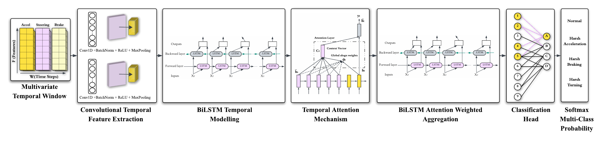

# CBANet: A Compact Attention-Based CNN–BiLSTM Network for Aggressive Driving Event Detection

Official implementation of **CBANet**, accepted at **IJCNN 2026**.

> **Paper:** [CBANet: A Compact Attention-Based CNN–BiLSTM Network for Aggressive Driving Event Detection](https://durham-repository.worktribe.com/output/5289947)  
> **Authors:** Hanadi Alhamdan · Ghadah Alosaimi · Amir Atapour-Abarghouei · Farshad Arvin  
> **Affiliations:** Durham University, UK · Princess Nourah bint Abdulrahman University, Saudi Arabia · Imam Mohammad Ibn Saud Islamic University, Saudi Arabia

---

## Abstract

Aggressive driving is a major cause of traffic accidents and poses a serious threat to road safety. Although deep learning methods have shown promising results in detecting risky driving behaviours from vehicle sensor data, their performance in real-world conditions is often limited by severe data imbalance, large variability between drivers, and the lack of physically interpretable vehicle dynamics representations. In this paper, we propose an enhanced deep learning framework for aggressive driving detection using multivariate vehicle dynamics signals. Instead of relying solely on raw measurements, the proposed approach constructs engineered dynamic features that capture steering, acceleration, and braking behaviour. To address the extreme rarity of aggressive events in naturalistic driving data, we introduce a stable training strategy that combines controlled SMOTE-based oversampling with a class-weighted loss formulation, and evaluates focal loss variants for imbalance handling. Furthermore, a safety-oriented decision strategy based on class-specific threshold calibration is adopted to better reflect the asymmetric risks of missed detections and false alarms in real-world applications. The proposed framework is evaluated on a newly collected naturalistic driving dataset. Extensive experiments show that the proposed method consistently outperforms standard deep learning baselines with significant improvements in minority-class recall and safety-critical F-score metrics while maintaining practical computational efficiency.

---

## Overview

CBANet classifies continuous vehicle telemetry into four driving behaviour categories:

| Class | Label |
|-------|-------|
| 0 | Normal driving |
| 1 | Harsh Acceleration |
| 2 | Harsh Braking |
| 3 | Harsh Turning |

**Architecture:** raw sensor windows → Conv1D feature extraction → Bidirectional LSTM temporal modelling → Attention weighting → Dense classifier.

The pipeline combines:
- 25 physics-inspired features engineered from 7 raw OBD/IMU signals
- Harsh-priority sliding-window labelling with rule-based physics override
- SMOTE oversampling (minority classes → 80% of majority) + class-weighted loss
- Per-class decision threshold calibration at inference time

---

## Results

### Comparison with Baselines (Table I)

| Model | Accuracy | ROC-AUC | F2 (Weighted) |
|-------|----------|---------|---------------|
| SVM | 0.9225 | 0.9854 | 0.9230 |
| K-NN | 0.8806 | 0.9682 | 0.8824 |
| CNN | 0.9386 | 0.9899 | 0.9385 |
| LSTM | 0.9413 | 0.9893 | 0.9413 |
| GRU | 0.9416 | 0.9907 | 0.9414 |
| RGAT (GAT + GRU) | 0.8947 | 0.9781 | 0.8947 |
| **CBANet** | **0.9585** | **0.9928** | **0.9584** |

### Session-Level and Driver-Level Generalisation (Table II)

| Setting | Accuracy | F2 (Weighted) | F2 (Macro) | ROC-AUC |
|---------|----------|---------------|------------|---------|
| Session-Level | 0.9446 | 0.9446 | 0.8791 | 0.9929 |
| Driver-Level | 0.9521 | 0.9519 | 0.8790 | 0.9934 |

**Model size:** 180,325 parameters · 0.76 MB · 1.43 ms/sample inference (NVIDIA RTX A6000)

---

## Installation

**Requirements:** Python 3.9–3.11. A CUDA-capable GPU is recommended but not required.

```bash
git clone https://github.com/halhamdan/CBANet.git
cd CBANet
pip install -r requirements.txt
```

Verify your environment:

```bash
python -c "import tensorflow as tf; print(tf.__version__); print(tf.config.list_physical_devices('GPU'))"
```

---

## Data Format

Place your pre-labeled CSV files under `./LABELED/`. Each file must contain:

| Column | Units |
|--------|-------|
| `Longitudinal acceleration (g)` | g-force |
| `Lateral acceleration (g)` | g-force |
| `Speed (km/h)` | km/h |
| `Accelerator_Pedal_Position (%)` | % |
| `Brake_Pedal_Position (%)` | % |
| `Engine_Speed (rpm)` | rpm |
| `Gradient (%)` | % |
| `Label` | `Normal` / `Harsh Acceleration` / `Harsh Braking` / `Harsh Turning` |

Data is expected at **25 Hz** sampling rate. Labels are pre-assigned using the deterministic threshold-based pipeline described in Section IV-B of the paper (θ_brake = −0.35g, θ_accel = 0.38g, θ_turn = 0.55g).

---

## Training

```bash
python train.py
```

Override any hyperparameter from the command line without editing files:

```bash
python train.py --data "./mydata/*.csv" --epochs 200 --batch-size 32 --seed 0
```

The pipeline:
1. Loads all CSVs from `./LABELED/` and tags each row with session and driver IDs
2. Engineers 25 physics-based features from the 7 raw signals
3. Creates 100-sample sliding windows (4 s, 75% overlap) per session with harsh-priority labelling
4. Applies SMOTE oversampling on the training split
5. Trains CBANet up to 300 epochs with early stopping (patience=15) and ReduceLROnPlateau (patience=6)
6. Optimises per-class decision thresholds on the validation set
7. Reports metrics at three granularities: aggregated, by session, and by driver
8. Saves the model, scaler, and thresholds to `./saved_models/`; plots to `./plots/`; CSV reports to `./results/`

**Key hyperparameters** (edit `config.yaml`, or override via CLI flags above):

| Parameter | Value | Description |
|-----------|-------|-------------|
| `WINDOW_SIZE` | 100 | Samples per window (4 s @ 25 Hz) |
| `STEP` | 25 | Stride (75% overlap) |
| `DATA_PATH` | `./LABELED/*.csv` | Input data glob pattern |
| Batch size | 64 | Mini-batch size |
| Optimizer | AdamW | lr=5e-4, weight_decay=1e-4 |
| Loss | Class-weighted CE (γ=0) | Best per ablation study (Table IV) |

---

## Model Architecture



```
Input: (batch, 100 timesteps, 25 features)
  │
  ├─ Conv1D(64 filters, k=5) → BatchNorm → MaxPool(2) → Dropout(0.2)
  ├─ Conv1D(128 filters, k=3) → BatchNorm → MaxPool(2) → Dropout(0.3)
  │
  ├─ BiLSTM(64, return_sequences=True, recurrent_dropout=0.2)
  │
  ├─ Temporal Attention (Dense tanh → softmax over time)
  │
  ├─ BiLSTM(32)
  ├─ Dense(64, relu) → BatchNorm → Dropout(0.4)
  ├─ Dense(32, relu) → Dropout(0.3)
  └─ Dense(4, softmax)
```

---

## Repository Structure

```
CBANet/
  train.py                         # Main entry point
  config.yaml                      # All hyperparameters (CLI-overridable)
  requirements.txt
  src/
    config.py                      # Constants and YAML config loader
    data_loading.py                # CSV loading with session/driver tagging
    preprocessing/
      feature_engineering.py       # 25 physics-inspired features from 7 raw signals
      windowing.py                 # Per-session sliding-window segmentation
      preprocessing.py             # SMOTE augmentation, normalisation, class weights
    model/
      model.py                     # CBANet architecture + focal loss
    evaluation/
      thresholds.py                # Per-class threshold calibration
      aggregated.py                # Overall test-set metrics
      by_session.py                # Per-session performance breakdown
      by_driver.py                 # Per-driver performance breakdown
      plotting.py                  # Confusion matrix, ROC, loss/accuracy curves
```

---

## Citation

```bibtex
@inproceedings{alhamdan2026cbanet,
  title     = {{CBANet}: A Compact Attention-Based {CNN}--{BiLSTM} Network for Aggressive Driving Event Detection},
  author    = {Alhamdan, Hanadi and Alosaimi, Ghadah and Atapour-Abarghouei, Amir and Arvin, Farshad},
  booktitle = {Proceedings of the International Joint Conference on Neural Networks (IJCNN)},
  year      = {2026}
}
```

---

## License

This project is released under the [MIT License](LICENSE).
